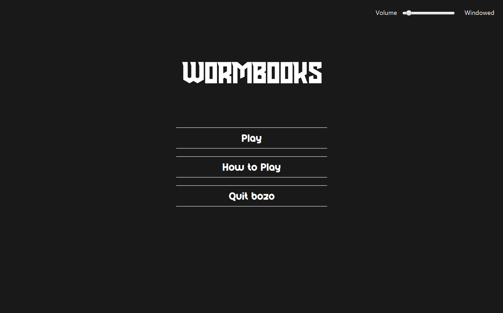
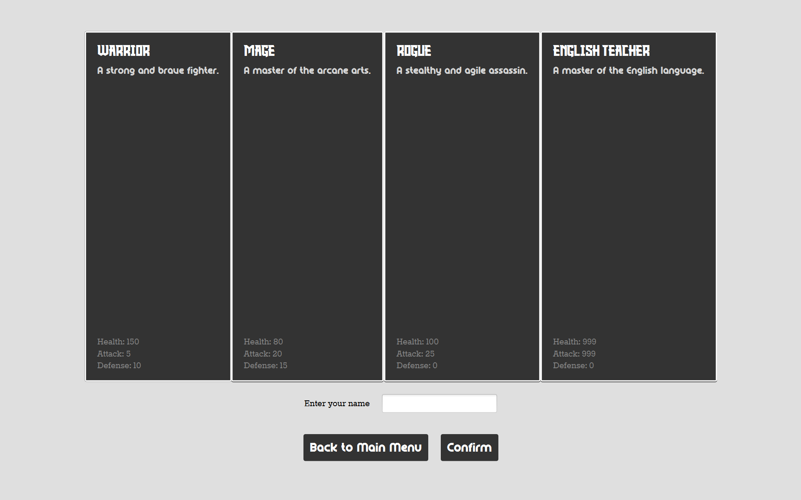
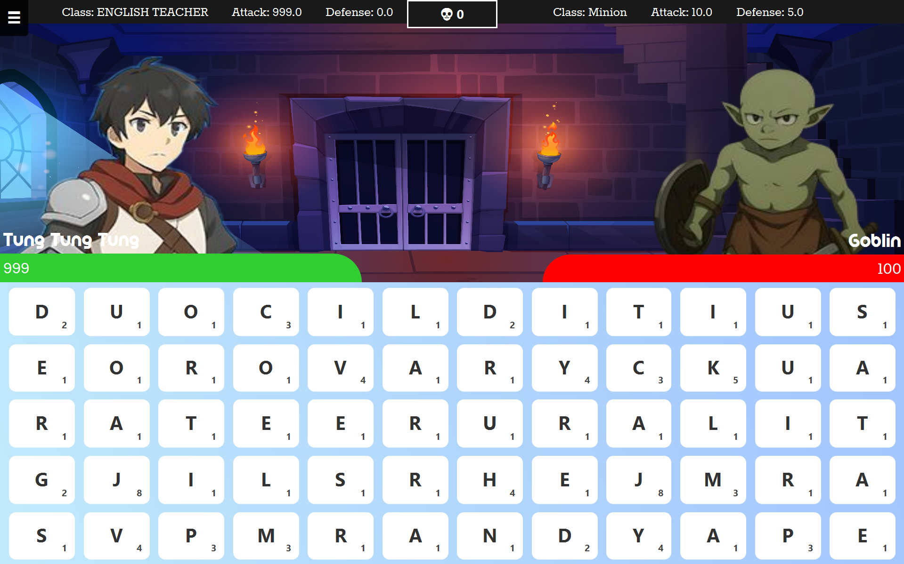
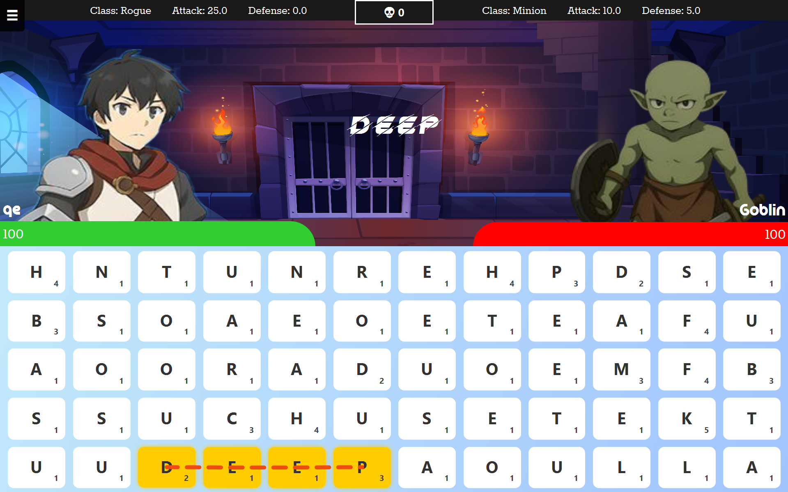
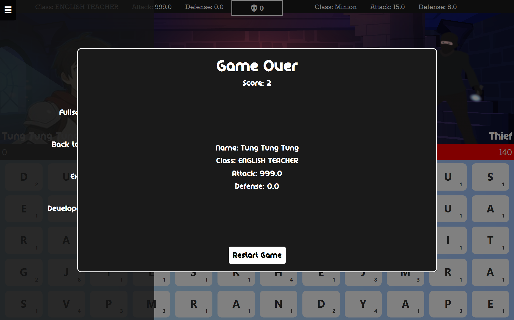

# WormBooks Game

**WormBooks** is a desktop game inspired by the classic **Bookworm**, developed as a final project for **CPE112**. It features a fun and educational word-forming gameplay experience — powered by efficient data structures.

---

## About the Project

This project was created as part of the final requirement for the **CPE112** course. The game challenges players to form words using adjacent letters on a grid, similar to the original Bookworm game. We incorporated key computer science concepts into the game's logic and data handling.

### Features

- Classic Bookworm-style gameplay
- Word validation using an **AVL Tree**
- Word tracking and backtracking with a **Stack**
- Smooth MSI installer for easy setup (only for windows. Sorry!)

---

## Data Structures Used

- **AVL Tree** – for storing and searching valid dictionary words efficiently
- **Stack** – to manage word tracking and backtracking

---

## Download and Install

You can download the **Windows installer (.msi)** using the link below:

[**Download the MSI Installer**](https://www.mediafire.com/file/5djdzlnrey9fwbv/CPE112Final-1.0.msi/file)

### 🛠 Installation Instructions

1. Download the `.msi` installer.
2. Double-click to begin installation.
3. Once installed, search for **CPE112Final App** in your start menu.
4. Launch and enjoy the game!

[VirusTotal Scan](https://www.virustotal.com/gui/file/86f84c4210eaef55d6c54cfba0dd62806cc91db766017ac15bac45b0ca6a165c?nocache=1) (for your peace of mind💀)

---

## 📷 Screenshots

---

## 👨‍💻 Developers

- **Me, absolutely**
- **Another 4 anonymous**

---

## 📜 License

This project was developed for educational purposes and is not licensed for commercial use.  
Feel free to fork and explore for learning!

---
