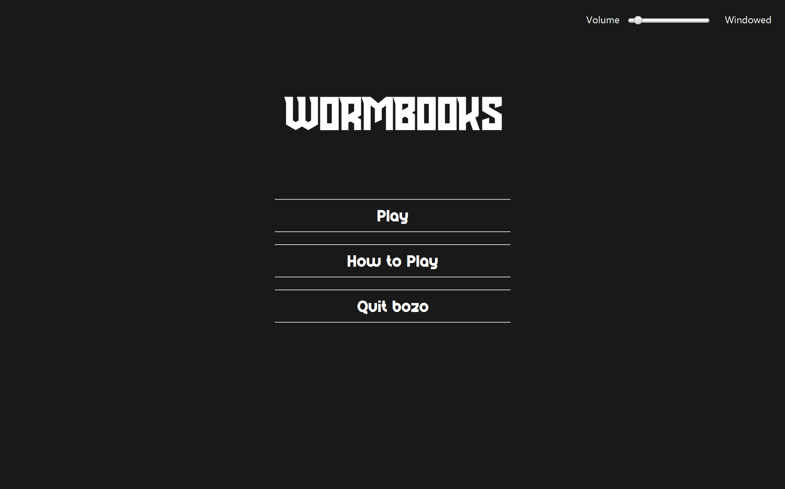
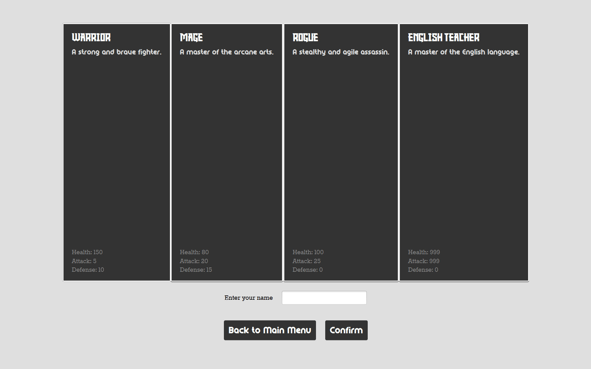
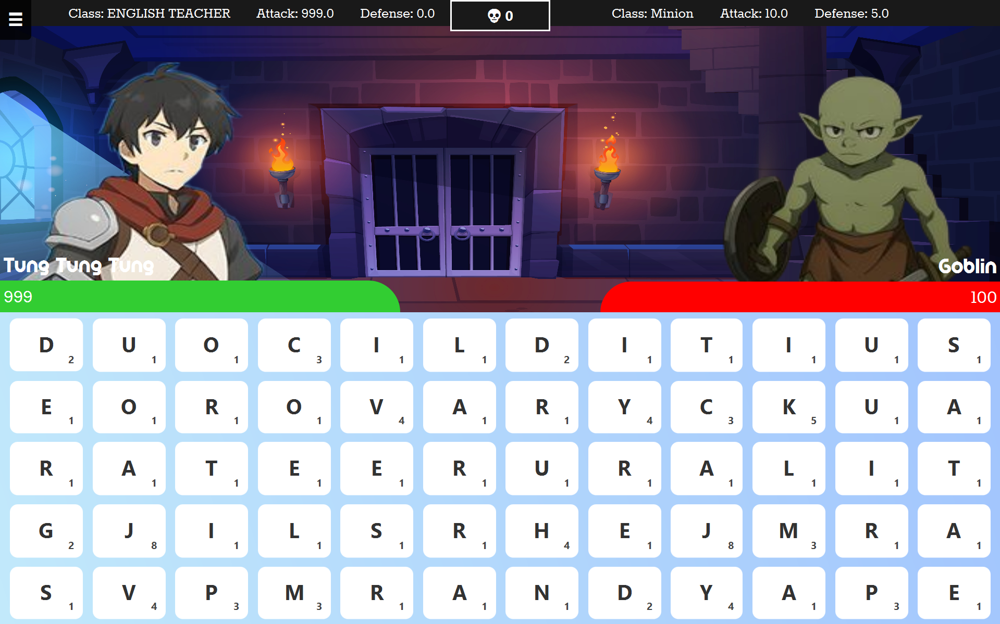
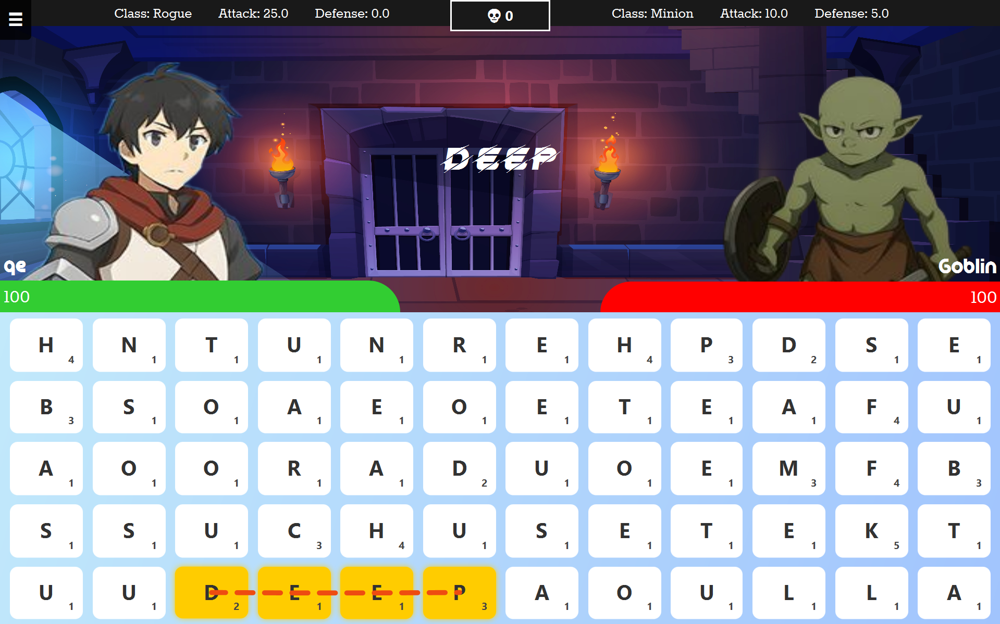
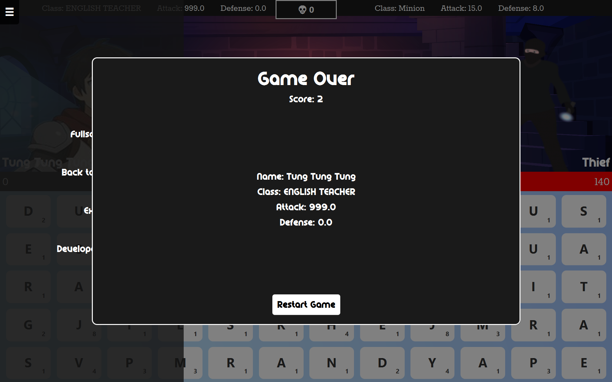

<!-- prettier-ignore -->
<div align="center">

# BookWorm

*A JavaFX word-battle game where vocabulary becomes damage.*


[Overview](#overview) • [Features](#features) • [Get started](#get-started) • [How to play](#how-to-play) • [Screenshots](#screenshots) • [Testing](#testing)

</div>

BookWorm is a JavaFX desktop word game inspired by *Bookworm*. Players connect adjacent letters on a grid to build valid English words, then convert those words into attacks against enemies and bosses.

The project was created as a final project for the CPE112 course and demonstrates practical use of data structures, scene management, JavaFX UI design, and game-loop logic in a complete desktop application.

> [!NOTE]
> The app window title currently appears as `BookWorms`, while the repository is named `BookWorm`. The README uses `BookWorm` for consistency with the repository.

## Overview

```text
BookWorm
  ├─ 5 x 12 letter grid
  ├─ AVL-tree dictionary lookup
  ├─ Stack-based tile selection and backtracking
  ├─ Class-based player stats
  ├─ Enemy and boss encounters
  └─ JavaFX scenes, audio, images, and responsive UI
```

A valid word becomes an attack. Longer words and higher-value letters deal more damage, while enemies scale over time and bosses appear every fifth encounter.

## Features

- Drag across adjacent tiles on a responsive 5 x 12 letter grid to form words.
- Validate submitted words against a bundled dictionary stored in an AVL tree.
- Track the current selection and support backtracking with stack behavior.
- Calculate damage from letter values and selected character-class stats.
- Choose from Warrior, Mage, Rogue, and English Teacher classes.
- Fight increasingly strong enemies, including boss encounters.
- Use fullscreen or windowed layouts with responsive controls.
- Play with background music, hover sounds, click sounds, and battle audio.
- View an in-game tutorial, pause menu, score summary, and developer controls.

## Tech stack

- Java, compiled with the Java 11 release target
- JavaFX 13: `controls`, `fxml`, and `media`
- Apache Maven
- Maven Shade Plugin for packaged JAR output

## Get started

### Prerequisites

- JDK 11 or newer
- Apache Maven 3.x
- A local JavaFX SDK for launching the modular application

The Maven build has been verified with JDK 17 and Maven 3.9.9.

### Install

```bash
git clone https://github.com/ArmmyC/BookWorm.git
cd BookWorm
mvn package
```

The package command compiles the game, copies resources, and creates these artifacts:

```text
target/cpe112finalproject-1.0-SNAPSHOT.jar
target/cpe112finalproject-1.0-SNAPSHOT-shaded.jar
```

### Run from source

Build the project first, then point Java at both the compiled classes and the `lib` directory of a local JavaFX SDK.

PowerShell:

```powershell
$env:PATH_TO_FX = "C:\path\to\javafx-sdk\lib"
java --module-path "target\classes;$env:PATH_TO_FX" --module cpe112finalproject/cpe112.finalproject.App
```

macOS or Linux:

```bash
PATH_TO_FX=/path/to/javafx-sdk/lib
java --module-path "target/classes:$PATH_TO_FX" --module cpe112finalproject/cpe112.finalproject.App
```

> [!IMPORTANT]
> Update `PATH_TO_FX` so it points to the `lib` folder inside your local JavaFX SDK.

> [!WARNING]
> The current `pom.xml` declares `javafx-maven-plugin` version `8.8.3`, which is not available from Maven Central. As a result, `mvn javafx:run` does not work without correcting that plugin configuration. The normal `compile`, `test`, and `package` lifecycle commands do work.

## How to play

1. Select **Play** from the main menu.
2. Enter a player name and choose a character class.
3. Press and drag across adjacent letter tiles to form a word.
4. Release the mouse to submit the word.
5. If the word is valid, it deals damage and used tiles are replaced.
6. Defeat enemies before their recurring attacks reduce your health to zero.
7. Use the menu button or `Esc` to access fullscreen, return-to-menu, exit, and developer options.

Longer words and higher-value letters deal more damage. Bosses appear periodically, so short valid words are useful for survival, while longer words help end fights faster.

## Maven commands

| Command | Description |
|---|---|
| `mvn compile` | Compile the application and copy resources. |
| `mvn test` | Run the Maven test lifecycle. No automated tests are currently present. |
| `mvn package` | Build the regular and shaded JAR artifacts in `target/`. |

## Project structure

```text
.
├── assets/                         README screenshots
├── src/main/java/
│   ├── module-info.java            Java module definition
│   └── cpe112/finalproject/
│       ├── Constants/              Shared names, paths, fonts, and styles
│       ├── Data/                   AVL tree and word dictionary helpers
│       ├── Entities/               Player and enemy UI entities
│       ├── Handlers/               Keyboard and mouse input
│       ├── Layout/                 JavaFX screens and interface components
│       ├── Logic/                  Puzzle, combat, health, and menu behavior
│       ├── Managers/               Player, enemy, scene, image, and sound state
│       ├── Responsives/            Responsive control sizing
│       ├── Scenes/                 Main menu, class selector, and game scenes
│       └── App.java                JavaFX application entry point
├── src/main/resources/cpe112/finalproject/
│   ├── fonts/
│   ├── images/
│   ├── sounds/
│   └── words.txt                   Bundled word list
└── pom.xml
```

## Screenshots

### Main menu



### Character selection



### Gameplay





### Game over



## Testing

Run the Maven test lifecycle with:

```bash
mvn test
```

The repository does not currently contain automated test sources. This command still verifies resource processing and compilation before Maven reports that there are no tests to run.

## Known limitations

- `mvn javafx:run` needs the JavaFX Maven Plugin configuration fixed before it can be used reliably.
- Running the app requires a local JavaFX SDK path.
- The project is currently optimized as a course project, not as a packaged installer.
